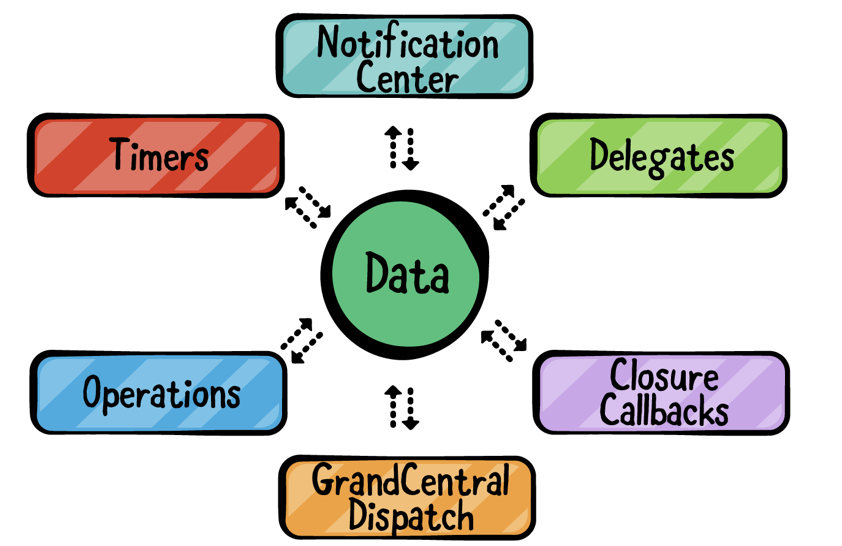
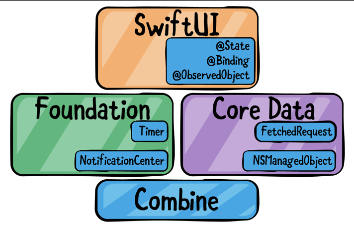
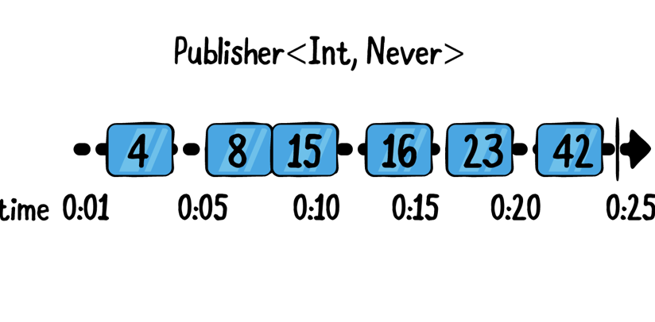
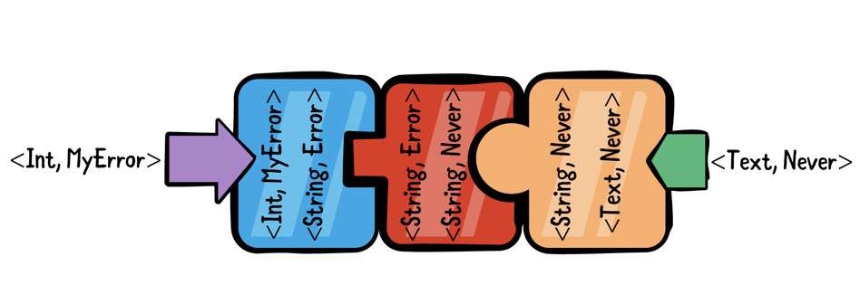
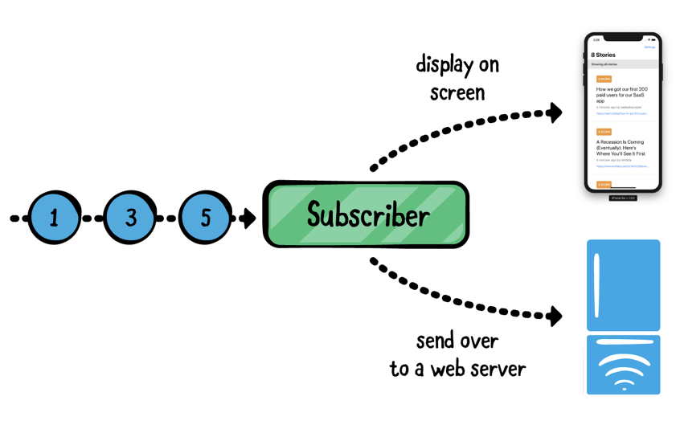

# Chapter1. Hello Combine!

앞으로 이 책은 선언형 프로그래밍과 반응형 앱을 Swift를 통해 작성 할 수 있도록 도와주는 Combine Framework에 대해 이야기 할 것이다.

Apple은 Combine을 이렇게 설명하고 있다. **"Combine Framework는 앱 프로세스 이벤트에 선언형 프로그래밍을 하는데 도와준다. 중구난방식의 delegate 콜백 형태나 클로져를 이용한 completion 형태가 아닌 하나의 스트림을 생성하여 이벤트를 관리할 수 있다. 각 스트림에 있는 Combine 오퍼레이터는 이전 단계에서 발생된 이벤트를 받아 동작을 실행 시킨다. "**

## Asynchronous programming

우선 싱글 스레드 언어로 간단하게, 아래 코드를 한줄씩 차례로 살펴보자.

~~~Swift
var name = "Tom"
print(name)
name += " Harding"
print(name)
~~~

동기 코드로는 data의 상태를 이해하는데 더욱 쉬울 수 있다. Single 스레드만 실행하게 된다면, 현재 data 상태가 어떤 상태인지 언제나 확실하게 알 수 있다. 위의 코드에서 첫번째 print에서는 "Tom", 두번째 print에서는 "Tom Harding"이라고 노출 된다는 것을 아는 것 처럼.

이제 멀티 스레드 환경에서 비동기 코드를 실행한다고 가정해보자. 

~~~swift
--Thread 1--
var name = "Tom"
print(name)
--Thread 2--
name = "Billy Bob"
--Thread 1--
name += " Harding"
print(name)
~~~

이전 코드에서는 "Tom"을 name에 할당하고 " Harding"을 추가로 할당했다. 하지만 동시에 다른 thread가 동작으로 인해 다른 thread로 인하여 "Billy Bob"이 name에 먼저 할당 될 수도 있다. 

다른 core가 동시에 실행 됨으로서, 어떤 부분의 코드로 인하여 공유 된 State가 먼저 수정 될 지 모르게 된다. 

정확하게 어떤 결과가 나올 지는 시스템 부하에 의존하게 되고, 프로그램을 실행 시킬 때 마다 다른 결과가 나올 것이다.

동시성 비동기 코드를 실행하는 것은 앱에서 mutable한 state를 관리하는 것이 주된 목표가 될 것이다.

## Foundation and UIKit/AppKit

Apple은 비동기 프로그래밍을 그들의 플랫폼을 위해 수년동안 발전시켜왔다. 굉장히 많은 메카니즘을 제시해왔는데, 대부분 당신이 사용했던 방법들이다. 

1. NotificationCenter
2. Ther Delegate pattern
3. Grand Central Dispatch / Operations
4. Closures

대부분 비동기 프로그래밍을 하는데 있어서 전형적으로 써왔던 내용들이다. 그리고 모든 UI 이벤트들은 애초에 비동기로 사용해왔다. 그래서 앱 코드 전체가  실행 될 순서를 알고 있는 것은 불가능하다. 

하지만, 비동기 프로그래밍을 작성하는 것은 가능하다. 복잡하지만 가능하긴하다.. 불행하게도, 비동기 코드와 리소스 공유는 재현, 추적등과 같이 수정하기 어려운 문제를 생성 할 수 있다. 

확실히, 이들중에서 가장 큰 문제는 아래의 사진처럼 대다수의 app들은 모두 다른 비동기 방식을 사용한다는 것이다.

Combine은 Swift 환경에서 이러한 혼돈의 비동기 코드들을 보다 더 깔끔하게 사용하는데에 도와주는데에 목표를 두고 있다.

Apple은 Combine API를 Foundation 프레임워크에 통합시켰다. 따라서 Timer, NotificationCenter, Core Data와 같은 core 프레임워크들도 이들의 언어를 사용하고 있다. 다행히 Combine은 너의 코드에 굉장히 쉽게 통합되어있다. 

추가로 Apple은 놀랍고 새로운 UI 프레임워크인 Swift UI에 Combine 역시 쉽게 통합시켰다. Apple이 Combine을 사용한 반응형 프로그래밍에 얼마나 노력했는지는 아래의 다이어그램을 보면 된다. 

Foundation부터 SwiftUI에 이르기까지 다양한 시스템 프레임 워크는 Combine에 의존하며 기존 비동기 방식의 대안으로 Combine을 제공한다. Combine이 Apple의 프레임워크가 되었으므로 더 이상 Timer나 NotificationCenter중 어떤 것을 선택해야 하는지에 대한 상황은 오지 않을 것이다. 이젠 더 이상 비동기 코드들을 작성 할 때 여러 형태의 코드들(Delegate, Noti, closure)을 모두 사용하는 것이 아닌 Combine만 작성하면 될 것이다. 

그래서 당신의 앱의 모든 네트워크 계층과 model과의 연결과 같은 부분들을 연결하는데에 모두 동일한 비동기 형식으로 사용하면 된다. 

## Foundation Of Combine

선언형 비동기 프로그래밍은 새로운 개념이 아니다. 오랫동안 사용되어 왔었지만, 갑작스레 눈에 띄어졌다. 최근에 가장 주목받은 것은 2009년에 Microsoft가 발표한 Reactive Extension (Rx) 라이브러리다. 

2012년에 MS는 오픈소스로서 Rx를 구현했고, 그 이후에 많은 언어들이 Rx 개념을 사용하였다. 현재 많은 언어들이 RxJS, RxScala, RxPHP등등과 같이 사용하고 있다. 

Apple 역시, RxSwift로 third-party 리액티브 프레임워크가 있었다. Combine은 Rx와 다르지만 유사한 Reactive Stream을 사용한다. Reactive Streams는 Rx와 몇 가지 주요 차이점이 있지만 둘 다 대부분의 핵심 개념은 동일하다.

하지만 Combine 프레임워크를 사용하는데에 있어서 제한사항들이 있다. 우선 iOS13/ macOs 카탈리나 이상이어야 한다. 하지만 Apple 프레임워크이다 보니 빠르게 퍼질것이고 수요가 급증 할 것이다. 

## Combine basics

Combine에서 3가지 핵심 단어를 기억해라. **Publishers, Operators, Subscribers** 물론 이보다 더 많은 것들이 있지만, 이 세가지 없이는 어떤 것도 완성 시킬 수 없다. Chapter2에서 Publisher와 Subscribers에 대해 알아갈 것이고, 두번째 section에서 많은 operator들에 대해 알아갈 것이다. 

이번 챕터에서는 이것들에 대해 간단하게 알아가는 시간을 가져볼 것이다. 

## Publishers

우선 Publisher는 type이다. 이것은 한개 이상의 value를 subscriber에게 방출할 수있다. Publisher의 내부로직과 상관없이 수학 계산, 네트워킹, 유저 이벤트들이 될 수 있고, 모든 Publishers는 다수의 이벤트를 방출 할 수 있는데, 그것들은 아래와 3가지와 같다.

1. Publisher의 gerneric 출력타입의 value
2. 완료한 completion
3. error 혹은 실패 type의 completion

Publisher는 Event를 안보낼 수도 있고, 여러개의 value를 출력할 수도 있다. 실패로 인해 완료가 되면 이벤트를 안보낼 수도 있다. 

아래는 publisher가 int 값을 방출하는 timeline을 보여준다. 

파란 박스는 타임라인에서 방출 된 Int 값임을 표현한다. 숫자들은 value임을 뜻한다. "->" 화살표는 스트림의 completion을 뜻한다. 

delegate를 추가하거나 completion callback을 주입하는 것들과 같은 작업들중 어떤 것을 선택하는 것 보다도 Publishers를 사용하는 것이 효과적일 수 있다.

Publishers의 가장 큰 특징 중 하나는 error 처리 기능이 내장되어 있다는 것이다. Error 처리는 마지막에 선택적으로 처리하는 것이 아니다. 

앞의 다이어그램에서 알 수 있듯이 Publisher 프로토콜은 2가지의 타입으로 나눠진다.

1. Publisher.Output은 publisher의 출력 값이다. 만약 출력 타입을  Int로 정의헀다면, String이나 Date 타입은 방출 할 수 없다.
2. Publisher.Failure는 publisher의 error 타입이다. 이것은 fail을 방출 할 수 있다. 만약 publisher가 절대 fail을 방출하지 않는다면, Never 타입을 사용하면 된다. 

##  Operators

Operator는 Publisher 프로토콜에 선언 된 동일한 Publisher나 새로운 Publisher를 반환한다. 많은 연산자를 차례로 호출하여 효과적으로 함께 연결할 수 있기 때문에 매우 유용하다. 

Operator들은 분리하여 구성이 가능하기 때문에 매우 복잡한 로직을 오퍼레이터로 간단하게 조합하여 구현이 가능하다. Operator를 조합하는 것은 마치 퍼즐 조각을 맞추는 것 같다. 하나의 Operator에서 출력 값이 다음 Operator의 입력 값과 일치하지 않는다면 조합이 불가능하기 때문에 실수로 순서를 잘못 맞추는 경우는 드물 것이다. 

위의 그림처럼 이러한 비동기 작업들을 Operator들을 조합하여 순서들을 맞춰 구현할 수 있습니다. (얼마나 좋습니까!!)

추가로 operator는 항상 input과 output이 존재하는데, 이들을 **upstream, downstream**이라고 한다. 이것들을 통해 데이터가 공유되는 것을 피할 수 있다. 

Operator는 이전 operator로 부터 data를 받고 output으로 다음 오퍼레이터 chain을 통해 제공하는 것이 핵심이다. 이는 비동기적으로 실행되는 다른 코드가 작업중인 데이터를 변경할 수 없음을 의미한다.

## Subscribers

드디어 구독 chain의 마지막에 도착했다. 모든 구독의 끝은 Subscriber가 존재한다. Subscribers는 일반적으로 방출된 output으로 무언가를 하던가 completion 이벤트를 받는다. 

현재 Combine은 2가지 형태의 Subscriber를 제공한다. 

1. **Sink** Subscriber는 output value와 completion을 받을 수 있는 closure를 제공한다. 
2. **assign** Subscriber는 model을 특정 property에 bind 하거나 혹은 UI에 직접적으로 제공할 때 사용한다. 

다른 방식으로 data를 다루고 싶다면 기존의 subscriber를 사용하기보다도 custom subscriber를 만들어서 사용하는 것이 더욱 효과적일 수 있다. Combine은 굉장히 간단한 protocol이다. 언제 어디서든 Custom 할 수 있고 그 custom 한것을 당신의 task에서 어디서든 사용할 수 있다.

## Subscriptions

> 이 책에서 말하는 Subscription은 Combine의 Subscription 프로토콜과 그것을 구현한 객체를 의미한다. 완전한 Publisher와 Operator, Subscriber들을 의미하기도 한다.

