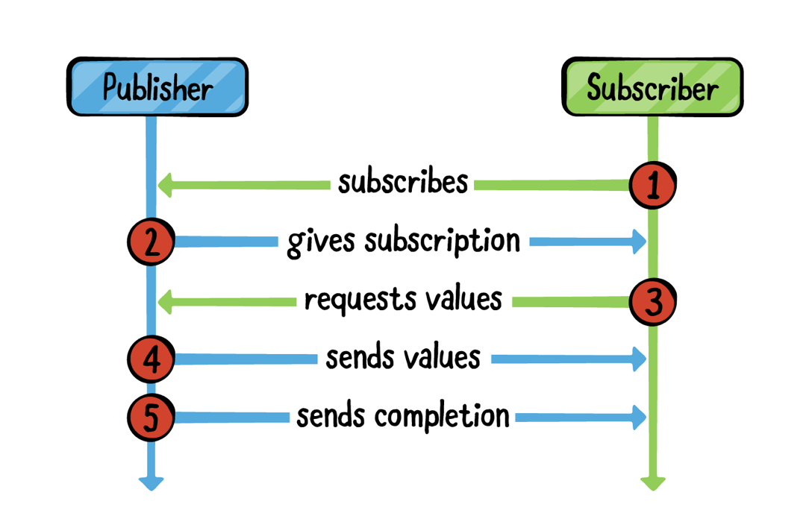

# Chapter2. Publishers & Subscribers

Chapter1에서 combine의 기본을 배웠을 것이다. 이제 Publsiher와 Subscriber를 살펴보며 한단계 나아가보자. 이번 챕터에서는 Publisher를 만들고 subscriber를 사용하여 해당 Publisher를 구독하는 예시들을 알아볼 것이다.

### Hello Publisher

Combine에서 핵심은 Publisher 프로토콜에 있다. 이 프로토콜은 Subscriber에게 방출하려는 값의 타입을 정의한다. 즉, Publisher는 알맞은 value 이벤트를 방출한다. 

Publisher는 기존 Notification center와 비슷하다고 생각하면 된다. 사실, NotificationCenter는 현재 publisher(for:object:) 메소드로 Publisher 타입에 noti를 보낼 수 있도록 제공해주고 있다.

~~~swift
// 1
  let myNotification = Notification.Name("MyNotification")

// 2
  let publisher = NotificationCenter.default
    .publisher(for: myNotification, object: nil)
~~~

__.publisher(for:object)__ 를 **Option-click** 해보면 Publisher를 리턴하는 것을 확인할 수 있다. 해당 publisher는 notification이 broadcast할 때 event를 방출 할 것이다.

이미 NotificationCenter에서는 broadcast를 방출을 하고 있다. 이는 Combine과 NotificationCenter와 연결이 가능 하다는 이야기이도 하다. 

Publisher는 두가지의 형태로 이벤트를 방출한다.

- Value
- Completion 이벤트

Publisher는 0개 이상의 이벤트를 방출 할 수 있지만, Completion(Error 혹은 completion)과 같은 이벤트는 한번만 방출한다. Publisher가 completion 이벤트를 방출할 때, 그 스트림은 더 이상 이벤트를 방출하지 않는다.

위의 예제에서 NotificationCenter를 통해 Observer를 등록한 것을 확인 할 수 있었다. 반대로 더 이상 옵저버가 필요 없어지면 등록 해제도 가능한데, 아래의 예제를 봐보자.

~~~swift
// 3
let center = NotificationCenter.default

// 4
let observer = center.addObserver(
  forName: myNotification,
  object: nil,
  queue: nil) { notification in
    print("Notification received!")
}

// 5
center.post(name: myNotification, object: nil)

// 6
center.removeObserver(observer)
~~~

위 코드는 Notificaion을 옵저버에 등록하고 해제하는 과정이다. 
다만 옵저버가 publisher를 통해 이벤트를 방출하고 있는 것이 아니다. 이를 위해 우리는 이제부터 Subscriber를 알아 볼 것이다.

### Hello Subscriber

Subscriber protocol은 Publisher로부터 이벤트를 받을 수 있도록 정의 된 프로토콜이다.

~~~swift
let myNotification = Notification.Name("MyNotification")

let publisher = NotificationCenter.default
 	.publisher(for: myNotification, object: nil)

let center = NotificationCenter.default
~~~

위의 코드는 Notification에 Post를 실행해도 publisher는 아무런 이벤트도 방출하지 않는다. 이유는 Publisher는 적어도 한개 이상의 Subscriber가 있어야만 이벤트를 방출 할 수 있기 때문이다.

#### Subscribing with sink(_:_:)

위의 코드에서 이어서 아래의 코드를 추가로 작성해보자

~~~swift
let subscription = publisher
  .sink { _ in
    print("Notification received from a publisher!")
  }
~~~

위의 코드에서는 publisher에 Sink를 호출하여 subscription을 만든 것이다. sink에 **Option-Click** 해보면 subscriber에게 closure를 Publisher가 방출하는 output에 연결하여 쉽게 제공하고 있는 것을 알 수 있다. 

sink 오퍼레이터는 publisher가 방출하는 값들을 계속해서 받을 것이다. 이는 unlimited demand라고 하며 추후에 다시 다룰 예정이다.

위의 예제에서는 제대로 다루지 않았지만, sink 오퍼레이터는 실제로 2가지의 클로져를 제공한다. 각각 completion 이벤트와 value를 담당하고 있다. 아래 코드를 보자.

~~~swift
// 1
  let just = Just("Hello world!")
  
  // 2
  _ = just
    .sink(
      receiveCompletion: {
        print("Received completion", $0)
      },
      receiveValue: {
        print("Received value", $0)
    })
~~~

1. just를 이용하여 Publisher를 생성하였고, primitive value 타입을 방출하고 있다. 
2. publisher에 subscription을 하여 각각의 이벤트에서 프린트를 하고 있다.

```
 ——— Example of: Just ———
 Received value Hello world!
 Received completion finished
```

Just를 **Option-Click** 해보면 각 Subscriber에게 이벤트를 한번 방출 후 완료되는 Publisher라고 설명하고 있다. 그럼 다음 코드를 추가해보자.

~~~swift
_ = just
 	.sink(
 		receiveCompletion: {
   			print("Received completion (another)", $0)
 		},
 		receiveValue: {
   			print("Received value (another)", $0)
 		}
 	)
~~~

```
 Received value Hello world!
 Received completion finished
 Received value (another) Hello world!
 Received completion (another) finished
```

print가 추가적으로 노출 되었는데, 각각의 subscriber에게 한 번 씩 이벤트를 방출하고 종료되는 것을 볼 수 있다.

#### Subscribing with assign(to: on:)
Subscription에는 sink오퍼레이터에서 추가적으로 assign 오퍼레이터도 있다. 

Assign 오퍼레이터는 KVO와 호환이 가능하며 해당 property에 할당이 가능하다. 

~~~swift
 // 1
  class SomeObject {
    var value: String = "" {
      didSet {
        print(value)
      }
    }
  }
  
  // 2
  let object = SomeObject()
  
  // 3
  let publisher = ["Hello", "world!"].publisher
  
  // 4
  _ = publisher
    .assign(to: \.value, on: object)

~~~

1. SomeObject 클래스를 정의하였고, didSet 프로퍼티 옵저버를 정의하여 새로운 value가 할당되면 print 하도록 하였다. 
2. SomeObject의 객체를 생성한다.
3. String 배열의 publisher를 정의한다.
4. 해당 publisher에 위에서 생성한 객체의 value 프로퍼티에 할당하여 구독한다. 

```
 ——— Example of: assign(to:on:) ———
 Hello
 world!
```

지금은 sink에 좀 더 중점을 두며 설명하였고, 추후 chapter 8에서 조금 더 집중적으로 다뤄본다. 

### Hello Cancellable

더 이상 필요 없는 네트워크 연결과 같은 이벤트들은 자원적으로 낭비이기 떄문에, subscription을 취소해야하는 경우가 있다. 

Subscription은 언제든 subscription을 취소 할 수 있는  AnyCancellable의 객체를 리턴한다. Subscriber가 끝나는 아래의 코드를 봐보자.

~~~swift
let subscription = publisher
 	.sink { _ in
 		print("Notification received from a publisher!")
 	}

// 1
 center.post(name: myNotification, object: nil)
 
 // 2
 subscription.cancel()
~~~

1. 이전과 같이 center를 post한다.
2. subscription을 cancel한다. Subscription 프로토콜이 Cancellabel을 상속했기 때문에 subscription으로 cancel()을 호출 할 수 있다.

~~~
 ——— Example of: Subscriber ———
 Notification received from a publisher!’
~~~

만약 subscription에서 명시적으로 cancel()을 호출하지 않는다면, publisher가 완료 되거나 메모리 관리가 subscription을 해제할 떄까지 subscription은 해제되지 않고 계속 유지 될 것이다.

> ```
> Playground의 구독에서 반환 된 값을 무시해도됩니다 (예 : _ = just.sink ...). 그러나 한 가지주의 할 점 : 전체 프로젝트에 구독을 저장하지 않으면 프로그램 흐름이 생성 된 범위를 벗어나는 즉시 구독이 취소됩니다. 
> ```

### Publisher와 Subscriber 이해하기



UML 다이어그램을 통해 조금 더 이해해보자.

1. Subscriber는 Publisher를 구독한다.
2. Publisher는 subscription을 만들어서 리턴한다.
3. Subscriber는 value를 요청한다.
4. Publisher는 value를 보낸다.
5. Publisher는 completion을 보낸다.

Publisher 프로토콜에서 가장 중요한 extension을 봐보자.

~~~swift
public protocol Publisher {
  // 1
  associatedtype Output

  // 2
  associatedtype Failure : Error

  // 4
  func receive<S>(subscriber: S)
    where S: Subscriber,
    Self.Failure == S.Failure,
    Self.Output == S.Input
}

extension Publisher {
  // 3
  public func subscribe<S>(_ subscriber: S)
    where S : Subscriber,
    Self.Failure == S.Failure,
    Self.Output == S.Input
}
~~~

1. Publisher가 생성할 수 있는 value type
2. Publisher가 생성 가능한 error type, 만약 error를 발생 시킨다고 보장한다면 Never
3. Subscriber는 publisher의 subscribe를 호출할 수 있다.
4. 구현된 subscribe는 `receive(subscriber:)`를 호출하여 subscriber를 publisher에 연결합니다. 즉, subscription을 만든다.

associated type은 subscription을 만드려면 subscriber가 반드시 일치시켜야하는 publisher의 인터페이스다.

이제 subscriber 프로토콜을 보자.

~~~swift
 public protocol Subscriber: CustomCombineIdentifierConvertible {
 	// 1
 	associatedtype Input

 	// 2
 	associatedtype Failure: Error

 	// 3
 	func receive(subscription: Subscription)

 	// 4
 	func receive(_ input: Self.Input) -> Subscribers.Demand

 	// 5
 	func receive(completion: Subscribers.Completion<Self.Failure>)
 }
~~~

1. subscriber가 받을 수 있는 value 타입
2. subscriber가 받을 수 있는 error 타입, 혹은 error를 받지 않는다면 Never
3. publisher가 subscription을 전달 받기 위해 subscriber의 receive를 호출한다.
4. publisher가 방출하는 새로운 값들을 전달하기 위해 subscriber의 `receive(_:)`를 호출한다.
5. publisher가 값 생성이 종료되었거나 error가 발생하였을 때 종료를 알리기 위해 subscriber의 `receive(completion:)`을 호출한다.

publisher와 subscriber는 subscription 프로토콜을 통해 연결된다. 

~~~swift
public protocol Subscription: Cancellable, CustomCombineIdentifierConvertible {
 	func request(_ demand: Subscribers.Demand)
 }
~~~

subscriber는 request를 호출하여 설정한 최대값이나 혹은 무제한의 value를 받을 수 있다.

>subscriber가 받을 수 있는 값의 수를 나타내는 subscriber 개념은 **backpressure 관리** 라고 한다. 이런 개념이 없으면 subscriber는 처리할 수 있는 것보다 많은 값을 publisher로부터 받아서 문제가 될 수 있다. Backpressure에 대해서는 Ch.18 Custom Publisher & Handling Backpressure 에 대해서 더 자세히 다룰 것이다.

Subscriber에서 receive가 Demand를 return 하는 것을 볼 수 있는데, 이는 subscription.request를 통해 subscriber가 새 값을 받을 때 마다 받을 수 있는 최대의 값 수를 조절할 수 있다는 것이다.

### Custom Subscriber 만들기

이전까지 배워 왔던 것을 연습해보는 시간이다.

~~~swift
// 1
  let publisher = (1...6).publisher
  
  // 2
  final class IntSubscriber: Subscriber {
    // 3
    typealias Input = Int
    typealias Failure = Never

    // 4
    func receive(subscription: Subscription) {
      subscription.request(.max(3))
    }
    
    // 5
    func receive(_ input: Int) -> Subscribers.Demand {
      print("Received value", input)
      return .none
    }
    
    // 6
    func receive(completion: Subscribers.Completion<Never>) {
      print("Received completion", completion)
    }
  }
~~~

1. Int 값들을 publisher로 생성.
2. IntSubscriber라는 custom subscriber 생성
3. Int를 input으로 받아들이도록, error는 방출되지 않도록 never로 명시
4. publisher를 통해 호출된 Receive 함수로 subscription시 최대 3개의 값만 수신하도록 지정후 subscription의 request 호출
5. 수신한 각 값을 print 하고 `.none` 을 반환하여 subscriber가 최대 수요를 조정하지 않음을 나타냄. 즉, `.none`은 `.max(0)` 과 같은 의미
6. completion event를 print

publisher 가 무엇이든 subscriber는 필요하므로 아래의 코드를 추가한다.

~~~swift
let subscriber = IntSubscriber()
publisher.subscribe(subscriber)
~~~

위를 통해 publisher의  output과 Failure 타입과 일치하는 subscriber를 생성하였다. 

~~~
 ——— Example of: Custom Subscriber ———
 Received value 1
 Received value 2
 Received value 3
~~~

콘솔을 확인하면 위와 같이 노출 되는데, Completion 이벤트를 받지 않은 것을 볼 수 있다. .max(3)을 통해 최대 수요 수를 지정하였기 떄문이다. 

Custom subscriber에서 receive 함수를 아래와 같이 .none에서 .unlimited로 아래와 같이 수정해보자.

~~~swift
func receive(_ input: Int) -> Subscribers.Demand {
  print("Received value", input)
  return .unlimited
}
~~~

```
 ——— Example of: Custom Subscriber ———
 Received value 1
 Received value 2
 Received value 3
 Received value 4
 Received value 5
 Received value 6
 Received completion finished
```

그러면 위와 같이 콘솔에서 출력될 것이다. 

이번엔 .unlimited 에서 .max(1)로 바꿔보도록 하자. 그리하면 .unlimited와 같은 결과가 나올 것이다. 왜냐하면 이벤트를 받을 때마다 receive함수가 실행 될 것이고, 최대 수요 값을 1씩 증가하는 것이 되버리기 때문이다.  

다시 .max(1)을 .none으로 바꾸고 publisher를 string publisher로 바꿔보자. 

```
 let publisher = (1...6).publisher
```

위의 코드를 아래 코드로 말이다.

```
 let publisher = ["A", "B", "C", "D", "E", "F"].publisher
```

 코드를 실행하면 error가 발생할 것인데, custom subscriber의 Input 타입이 맞지 않기 떄문이다. 