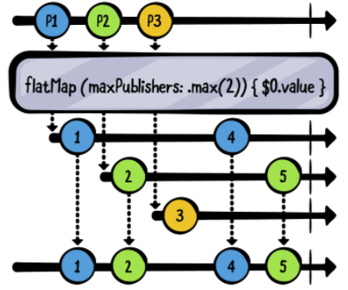
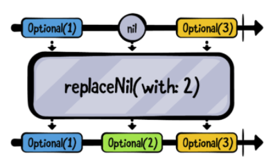
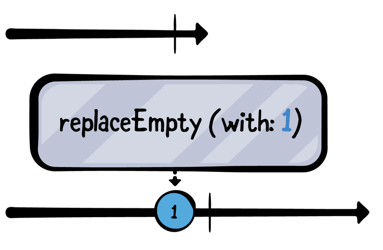
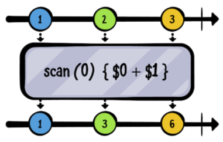

# Chapter3. Transaforming Operators

Combine에서는 Publisher들이 주는 Value를 제어하는 method들을 Operator라고 한다.

## Collectiing Values

Publisher들은 Value의 Collection 형태로 혹은 각각의 value를 방출한다. 

### collect()


**collect()**는 publisher가 방출한 각각의 value들을 array로 변환시켜준다. 이 책에서 operator를 쉽게 이해하려면 **marble 다이어그램**에 대한 이해가 필요하다. 

> Marble 다이어그램은 operator가 어떻게 작동하는지 시각적으로 보여준다. 상단의 줄은 upstream publisher를 뜻한다. 가운데의 박스는 operator를 의미하고, 하단에 있는 줄은 subscriber를 뜻하는데, upstream line이 방출한 값이 operator를 통해 수정되어서 받게 되는 것을 의미한다. 

위의 마블다이어그램을 살펴보면, collect는 각각의 value들을 가지고 있다가 upstream publisher가 complete 이벤트를 방출하면, downstream에 array 형태로 전달한다. 

~~~swift
["A", "B", "C", "D", "E"].publisher
    .sink(receiveCompletion: { print($0) },
          receiveValue: { print($0) })
    .store(in: &subscriptions)
~~~


위의 예제는 아직 collect() 오퍼레이터를 사용하지 않았고 아래와 같이 출력된다.

~~~~~swift
A
B
C
D
E
finished
~~~~~

이젠 sink 이전에 collect 오퍼레이터를 추가해보겠다. 

~~~swift
["A", "B", "C", "D", "E"].publisher
  .collect()
  .sink(receiveCompletion: { print($0) },
        receiveValue: { print($0) })
  .store(in: &subscriptions)
~~~

~~~swift
——— Example of: collect ———
["A", "B", "C", "D", "E"]
finished
~~~

> collect 오퍼레이터를 사용할떄는 주의할 점이 있다. 저장될 buffer의 크기를 따로 저장하지 않으니 무제한으로 버퍼를 저장할 수 있는데, 무한한 양의 메모리를 사용할 수 있다는 점을 생각하자

collect 오퍼레이터는 여러 형태로 사용 가능하다.

~~~swift
.collect(2)	
~~~

~~~swift
-—— Example of: collect ———
["A", "B"]
["C", "D"]
["E"]
finished
~~~

## Mapping Values

### map()

map Operator는 기존 swift의 map과 상당히 유사하다. 


마블 다이어그램에서 보면 알 수 있지만, map 오퍼레이터를 통해 각각의 value를 2씩 곱해주고 있다. 

~~~swift
 // 1
  let formatter = NumberFormatter()
  formatter.numberStyle = .spellOut
  
  // 2
  [123, 4, 56].publisher
    // 3
    .map {
      formatter.string(for: NSNumber(integerLiteral: $0)) ?? ""
    }
    .sink(receiveValue: { print($0) })
    .store(in: &subscriptions)
~~~

~~~
——— Example of: map ———
one hundred twenty-three
four
fifty-six
~~~

위의 코드처럼 map을 통해 publisher가 방출하는 각각의 value를 변경할 수 있다.

#### Map Key paths

map Operator는 key path 를 사용하여 3가지 버젼을 사용할 수 있다.

- map<T>(_:)
- map<T0, T1>(_:_:) 
- map<T0, T1, T2>(_:_:_:)

다음 예제에서는 **Sources/SupportCode.swift** 파일에 있는 Coordinate type의 quadrantOf(x:y:) 메서드를 사용할 것이다. Coordinate는 x와 y 두개의 프로퍼티를 갖고 있는데, . `quadrantOf(x:y:)`는 이 프로퍼티를 파라미터로 받아 사분면을 나타내는 문자열로 반환해준다. 아래 예제에서는 `map(_:_:)`을 사용하고 있다.

~~~swift
   // 1
   let publisher = PassthroughSubject<Coordinate, Never>()
   
   // 2
   publisher
     // 3
     .map(\.x, \.y)
     .sink(receiveValue: { x, y in
       // 4
       print(
         "The coordinate at (\(x), \(y)) is in quadrant",
         quadrantOf(x: x, y: y)
       )
     })
     .store(in: &subscriptions)
   
   // 5
   publisher.send(Coordinate(x: 10, y: -8))
   publisher.send(Coordinate(x: 0, y: 5))
~~~

위의 예제에서는 2개의 프로퍼티 keyPath를 사용하는 map 버젼을 사용하고 있다.

1. error를 절대 방출하지 않는 Never타입과 `Coordinate` 타입의 Publisher를 생성하였다.
2. publisher를 구독하기 시작한다.
3. key path를 사용하여 `Coordinate` 프로퍼티의 x,y를 map에 사용하였다.
4. value를 받는 곳에 print를 하여 결과를 확인한다.
5. publisher에게 `Coordinate` 타입의 값을 방출한다.

~~~swift
 ——— Example of: map key paths ———
 The coordinate at (10, -8) is in quadrant 4
 The coordinate at (0, 5) is in quadrant boundary
~~~

### tryMap(_:)

map을 포함한 다수의 operator들은 try가 앞에 붙는 오퍼레이터를 가지고 있다. 이 오퍼레이터들은 error를 던지는 closure를 갖고 있다. 만약 error를 던진다면, 해당 오퍼레이터는 downStream에 에러를 방출할 것이다. 

~~~swift
//1
Just("Directory name that does not exist")
     // 2
     .tryMap { try FileManager.default.contentsOfDirectory(atPath: $0) }
     // 3
     .sink(receiveCompletion: { print($0) },
           receiveValue: { print($0) })
     .store(in: &subscriptions)
~~~

1. 존재하지 않는 디렉토리 경로의 string을 publisher 형태로 방출한다.
2. tryMap 오퍼레이터를 통해 존재하지 않는 디렉토리의 내용을 받는다.
3. 방출하는 값이나 완료 이벤트를 print 하도록 한다.

error를 방출하는 메소드를 호출할 때, 여전히 `try` 키워드를 사용한 것을 주목해라. 

위의 코드를 실행하면, tryMap이 failure completion을 출력한 것을 알 수 있다.

~~~swift
 ——— Example of: tryMap ———
 failure(..."The folder “Directory name that does not exist” doesn't exist."...)
~~~

## Flattening publishers

### flatMap(maxPublishers:_:)

리액티브 프로그래밍을 사전에 배워본 적이 없는 사람이라면, 이번 챕터가 어렵게 느껴질 수도 있다. 

문제가 되는 오퍼레이터는 flatMap이다. 교과서적인 정의를 먼저 배운 후 flatMap의 작동 방식을 예제를 통해 알아 볼 예정이다. 이번 섹션이 다 끝나면 완벽하게 습득할 수 있을 것이다. 따라와요 출발.

`flatMap` 오퍼레이터는 여러개의 upstream publisher들을 하나의 downstream publisher로 병합할 수 있다. 

> 좀 더 구체적으로 말하면, 해당 publisher의 방출량을 병합할 수 있다.

`flatMap` 은 수신 받은 upstream publisher와 방출 할 downstream publisher가 같은 타입이 아닐 수 있다.  우선 `flatMap` 이 여러 publisher의 입력을 병합하는 것보다 flatMap의 출력하는 부분에 초점을 맞춰 먼저 알아보자. 

기존 Swift에서  `flatMap` 에서  ` compactMap`으로 이름이 변경된 것을 기억하는가? 서로 전혀 다른 flatMap이라는 것을 알 수 있을 것이다. 

Combine에서 사용되는 `flatMap` 의 주된 사용 방법은 publisher들을 값으로 방출하는 publisher를 subscribe할 때다. 

**Sources/SupportCode.swift** 파일에서 두개의 프로퍼티를 갖고 있는 Chatter 구조체를 주목해라. 

~~~~swift
public struct Chatter {
  public let name: String
  public let message: CurrentValueSubject<String, Never>
  
  public init(name: String, message: String) {
    self.name = name
    self.message = CurrentValueSubject(message)
  }
}
~~~~

1. name 이라는 String 프로퍼티
2. String 값을 받는 message라는 CurrentValueSubject 프로퍼티

위의 구조체로 아래의 예제를 진행해보자.

~~~swift
// 1
  let charlotte = Chatter(name: "Charlotte", message: "Hi, I'm Charlotte!")
  let james = Chatter(name: "James", message: "Hi, I'm James!")
  
  // 2
  let chat = CurrentValueSubject<Chatter, Never>(charlotte)
  
  // 3
  chat
    .sink(receiveValue: { print($0.message.value) })
    .store(in: &subscriptions)
~~~

1. Charlotte와 James를 name으로 하는 두개의 Chatter 객체를 생성하였다.
2. charlotte 변수를 초기 값으로 갖는 CurrentValueSubject를 생성하였다.
3. chat을 구독하여 Chatter의 message 값을 출력한다.

```
 ——— Example of: flatMap ———
 Charlotte wrote: Hi, I'm Charlotte!
```

이제 다음 코드를 추가해보자.

~~~swift
 // 4
 charlotte.message.value = "Charlotte: How's it going?"

 // 5
 chat.value = james
~~~

~~~
Charlotte wrote: Hi, I'm Charlotte!
James wrote: Hi, I'm James!
~~~

결과를 보면 4번의 Charlotte의 새로운 메세지는 볼 수 없을 것이다. 하지만 james의 초기 값이 출력 된 것을 확인 할 수 있다. 이유는 chat을 구독한것이지 각 chat의 message를 구독한 것은 아니기 때문이다. 만약 모든 chat의 message를 구독하고 싶다면 flatMap을 사용하면 된다.

~~~swift
chat
  .sink(receiveValue: { print($0.message.value) })
  .store(in: &subscriptions)
~~~

위의 코드를 아래로 변경해보자. 

~~~swift
chat
  // 6
  .flatMap { $0.message }
  // 7
  .sink(receiveValue: { print($0) })
  .store(in: &subscriptions)
~~~

6. Chatter의 message를 flatMap에 넣는다.
7. 이전처럼 Chatter의 객체가 아닌 String 값을 print 한다.

위의 변경된 코드를 아까 작성했던 대로 다시 실행하면 아래와 같이 출력한다.

~~~swift
Hi, I'm Charlotte!
Charlotte: How's it going?
Hi, I'm James!
~~~

이제 다음 코드를 추가해 보자

~~~~swift
 james.message.value = "James: Doing great. You?"
 charlotte.message.value = "Charlotte: I'm doing fine thanks.
~~~~

~~~
 James: Doing great. You?
 Charlotte: I'm doing fine thanks.
~~~

결과는 위와 같다. james의 chat 값이 변경되었는데도 Charlotte의 새 메세지가 잘 찍히는 것을 볼 수 있다.

이 섹션의 초반에 말했던 flatMap을 다시 말해보자면, flatMap은 publisher가 방출하는 모든 값들을 하나의 publisher로 병합한다. 하지만 메모리 이슈를 고려해야하는데, downstream에서 방출하는 하나의 Publisher를 업데이트 하려면 전송하는 Publisher 만큼 버퍼를 가지고 있어야 하므로 메모리 문제가 발생한다. 

이러한 버퍼 이슈 때문에, flatMap은 선택적으로 maxPublishers 파라미터를 받는다. 

~~~swift
.flatMap { $0.message }
~~~

~~~swift
.flatMap(maxPublishers: .max(2)) { $0.message }
~~~

maxPublishers에 값을 넘기며 최대 2개의 upstream publisher를 받는다고 정의하였다. 이제부터는 2개 이상의 publisher는 무시하게 될 것이고, maxPublishers 값을 넘기지 않으면 .unlimited가 된다. 



위의 마블다이어 그램에서 flatMap은 P1,P2,P3 3개의 publisher를 받는다. 각각의 publisher들은 value 프로퍼티를 갖고 있고, 이들 또한 publisher들이다. flatMap은 방출된 P1,P2를 받지만, P3는 무시한다. maxPublishers를 2로 설정했기 때문이다. 

다시 maxPublishers에 2를 설정한 예제로 돌아와서 아래의 코드를 추가해보자. 

~~~swift
 // 8
 let morgan = Chatter(name: "Morgan",
                      message: "Hey guys, what are you up to?")

 // 9
 chat.value = morgan

 // 10
 charlotte.message.value = "Did you hear something?
~~~

8. Chatter 객체를 생성
9. morgan을 chat publisher에 추가한다. 
10. charlotte의 메세지를 변경한다. 

~~~
 ——— Example of: flatMap ———
 Hi, I'm Charlotte!
 Charlotte: How's it going?
 Hi, I'm James!
 James: Doing great. You?
 Charlotte: I'm doing fine thanks.
 Did you hear something?
~~~

morgan의 메세지는 찍히지 않는 것을 볼 수 있는데, flatMap은 두개의 publisher만 받도록 설정했기 때문이다.

## Upstrean output 변경하기

앞서 Map 예제에서 잘 동작했던 Formatter.string(for:) 메서드는 리턴 값이 옵셔널 String이다.  `??` 오퍼레이터를 통해 nil 값을 nil 아니게 변환하였는데, Combine도 이처럼 nil을 대응하는 오퍼레이터가 있다.

### replaceNil(with:)



위의 마블다이어그램을 보면, replaceNil이 nil을 받게 되면 with: 파라미터에 넘긴 값을 방출하고 있다.

~~~swift
   // 1
   ["A", nil, "C"].publisher
     .replaceNil(with: "-") // 2
     .sink(receiveValue: { print($0) }) // 3
     .store(in: &subscriptions)
~~~

1. 옵셔널 문자 배열 publisher를 생성한다.
2.  `replaceNil(with:)`를 이용하여 upstream publisher로 부터 받은 nil을 "-"으로 변환한다.
3. value를 출력한다.

~~~
 ——— Example of: replaceNil ———
 Optional("A")
 Optional("-")
 Optional("C")
~~~

출력된 것을 보면 알 수 있지만, 옵셔널까지 언래핑 되진 않았다. 이름처럼 nil 값을 설정한 값으로 변경하지만 할 뿐이다. replaceNil을 옵셔널을 언래핑 하려면 아래와 같이 해야한다.

~~~swift
 ["A", nil, "C"].publisher
    .replaceNil(with: "-")
    .map { $0! }
    .sink(receiveValue: { print($0) })
    .store(in: &subscriptions)
~~~

~~~
A
-
C
~~~

### replaceEmpty(with:)

`replaceEmpty` 오퍼레이터는 publisher가 값 방출 없이 완료되었을 때, 지정된 값으로 방출해준다.



~~~swift
 // 1
   let empty = Empty<Int, Never>()
   
   // 2
   empty
     .sink(receiveCompletion: { print($0) },
           receiveValue: { print($0) })
     .store(in: &subscriptions)
~~~

1. 바로 완료 이벤트를 방출하는 빈 publisher를 생성한다.
2. 이를 구독하고 받은 이벤트를 print 한다. 

~~~
——— Example of: replaceEmpty ———
finished
~~~

> Empty publisher는 바로 .finished 완료 이벤트를 방출하는 publisher를 생성하는데 사용한다. 그리고 completeImmediately 파라미터에 false를 전달하면 아무것도 방출하지 않는다. 

이제 replaceEmpty를 추가해보자.

~~~swift
 // 1
   let empty = Empty<Int, Never>()
   
   // 2
   empty
	   .replaceEmpty(with: 1)
     .sink(receiveCompletion: { print($0) },
           receiveValue: { print($0) })
     .store(in: &subscriptions)
~~~

~~~
1
finished
~~~

## Incrementally transforming output

### scan()

이번 챕터에서 가장 좋은 예제는 scan 오퍼레이터다. 



위의 마블 다이어그램을 보면 scan은 시작값인 0으로 각 publisher로부터 값을 받은 이전에 저장하고 출력한다. 

~~~swift
   // 1
   var dailyGainLoss: Int { .random(in: -10...10) }

   // 2
   let august2019 = (0..<22)
     .map { _ in dailyGainLoss }
     .publisher

   // 3
   august2019
     .scan(50) { latest, current in
       max(0, latest + current)
     }
     .sink(receiveValue: { _ in })
     .store(in: &subscriptions)
~~~

