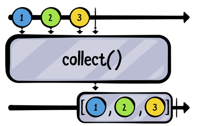
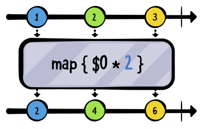

# Chapter3. Transaforming Operators

Combine에서는 Publisher들이 주는 Value를 제어하는 method들을 Operator라고 한다.

## Collectiing Values

Publisher들은 Value의 Collection 형태로 혹은 각각의 value를 방출한다. 

### collect()

**collect()**는 publisher가 방출한 각각의 value들을 array로 변환시켜준다. 이 책에서 operator를 쉽게 이해하려면 **marble 다이어그램**에 대한 이해가 필요하다. 

> Marble 다이어그램은 operator가 어떻게 작동하는지 시각적으로 보여준다. 상단의 줄은 upstream publisher를 뜻한다. 가운데의 박스는 operator를 의미하고, 하단에 있는 줄은 subscriber를 뜻하는데, upstream line이 방출한 값이 operator를 통해 수정되어서 받게 되는 것을 의미한다. 

위의 마블다이어그램을 살펴보면, collect는 각각의 value들을 가지고 있다가 upstream publisher가 complete 이벤트를 방출하면, downstream에 array 형태로 전달한다. 

~~~swift
["A", "B", "C", "D", "E"].publisher
    .sink(receiveCompletion: { print($0) },
          receiveValue: { print($0) })
    .store(in: &subscriptions)
~~~

위의 예제는 아직 collect() 오퍼레이터를 사용하지 않았고 아래와 같이 출력된다.

~~~~~swift
A
B
C
D
E
finished
~~~~~

이젠 sink 이전에 collect 오퍼레이터를 추가해보겠다. 

~~~swift
["A", "B", "C", "D", "E"].publisher
  .collect()
  .sink(receiveCompletion: { print($0) },
        receiveValue: { print($0) })
  .store(in: &subscriptions)
~~~

~~~swift
——— Example of: collect ———
["A", "B", "C", "D", "E"]
finished
~~~

> collect 오퍼레이터를 사용할떄는 주의할 점이 있다. 저장될 buffer의 크기를 따로 저장하지 않으니 무제한으로 버퍼를 저장할 수 있는데, 무한한 양의 메모리를 사용할 수 있다는 점을 생각하자

collect 오퍼레이터는 여러 형태로 사용 가능하다.

~~~swift
.collect(2)	
~~~

~~~swift
-—— Example of: collect ———
["A", "B"]
["C", "D"]
["E"]
finished
~~~

## Mapping Values

### map()

map Operator는 기존 swift의 map과 상당히 유사하다. 

마블 다이어그램에서 보면 알 수 있지만, map 오퍼레이터를 통해 각각의 value를 2씩 곱해주고 있다. 

~~~swift
 // 1
  let formatter = NumberFormatter()
  formatter.numberStyle = .spellOut
  
  // 2
  [123, 4, 56].publisher
    // 3
    .map {
      formatter.string(for: NSNumber(integerLiteral: $0)) ?? ""
    }
    .sink(receiveValue: { print($0) })
    .store(in: &subscriptions)
~~~

~~~
——— Example of: map ———
one hundred twenty-three
four
fifty-six
~~~

위의 코드처럼 map을 통해 publisher가 방출하는 각각의 value를 변경할 수 있다.

### Map Key paths

map Operator는 key path 를 사용하여 3가지 버젼을 사용할 수 있다.

- map<T>(_:)
- map<T0, T1>(_:_:) 
- map<T0, T1, T2>(_:_:_:)

