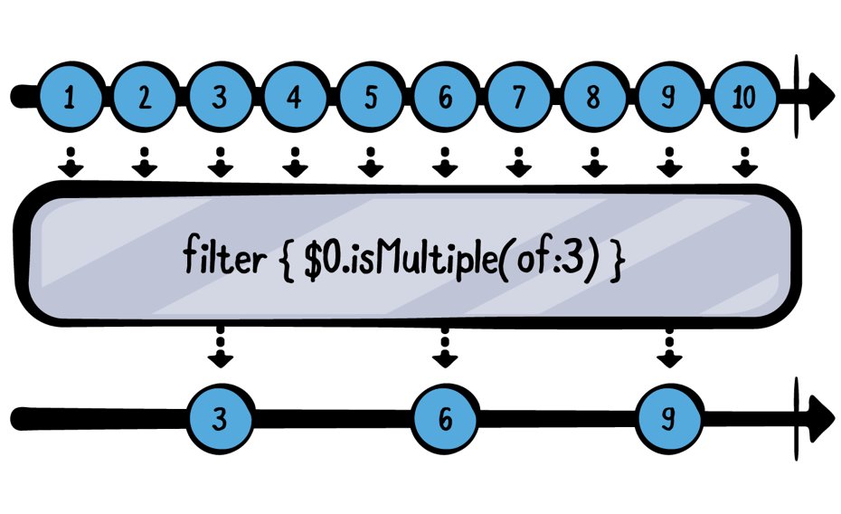
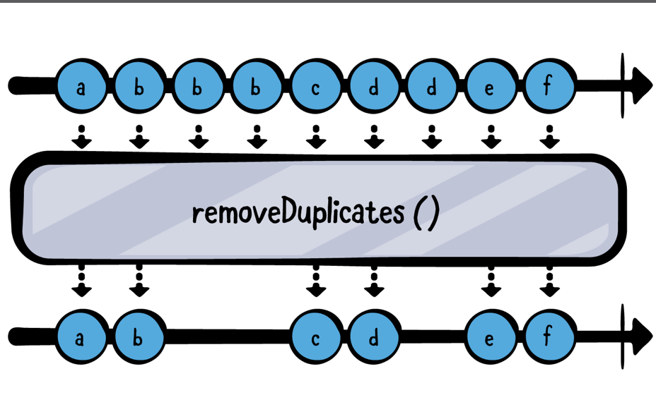
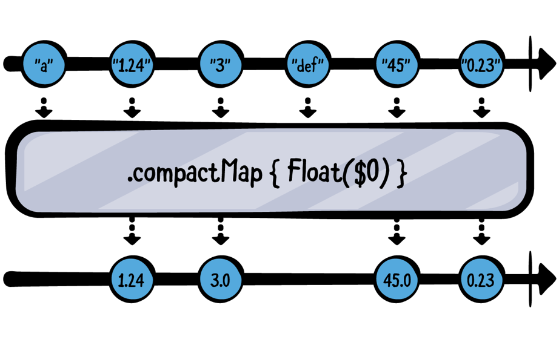
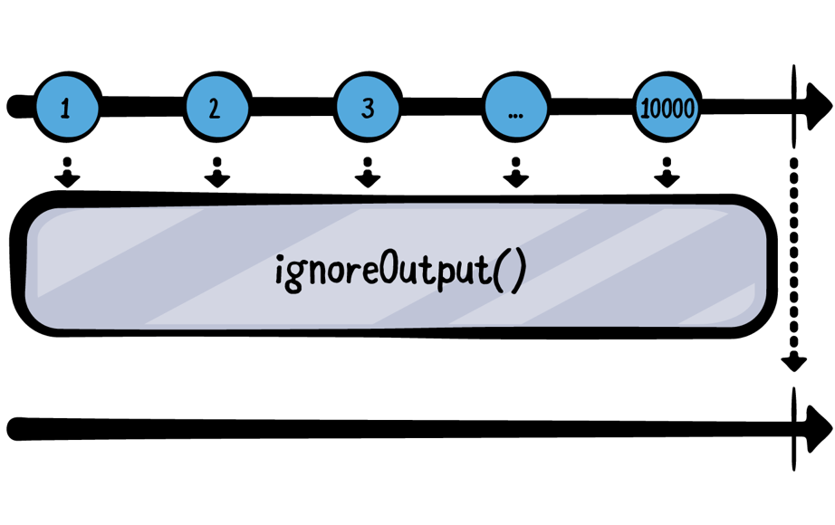
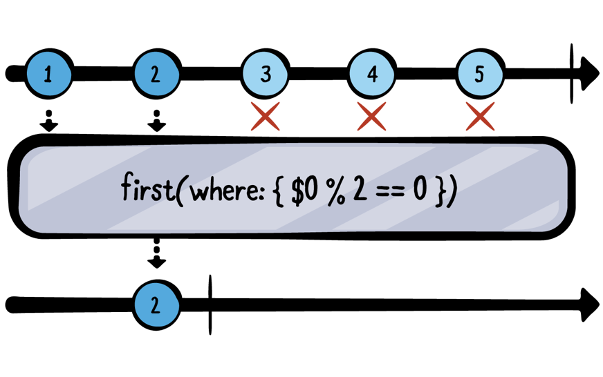
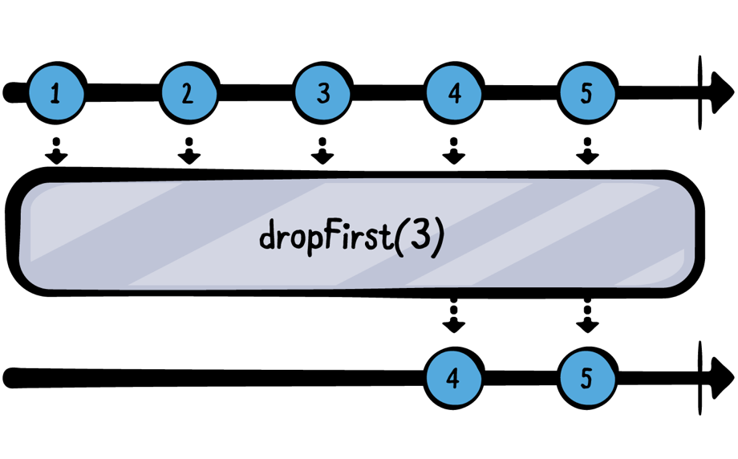
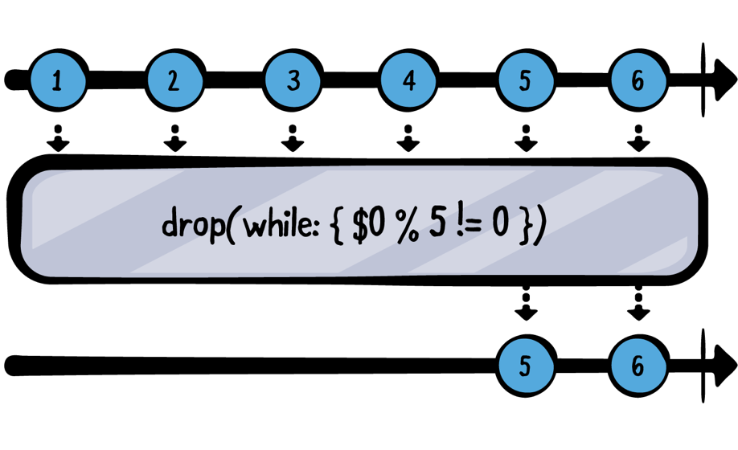
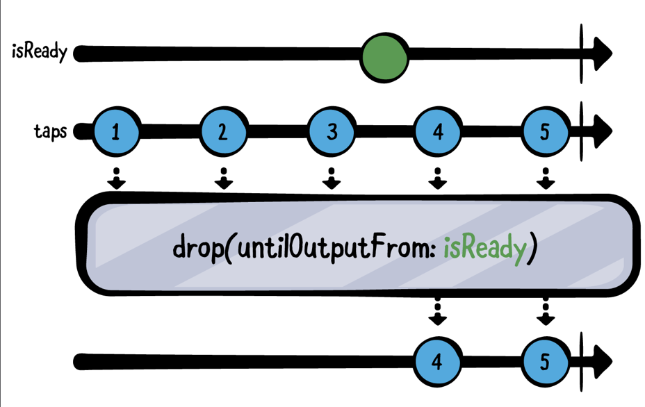

# Chapter4. Filterting Operators

지금쯤이면 체감하게 된 사실 일 지 모르겠지만, 오퍼레이터는 Combine에서 Publisher와 통신하기 위한 어휘들과 같다. 단어(오퍼레이터)들을 많이 알수록 데이터를 더욱 잘 다룰 수 있게 될 것이다. 

이전 챕터에서는 값을 소비하고 다른 값으로 변환하는 것 위주로 알아보았다. 이번 챕터에서는 Publisher가 생성하는 값이나 이벤트를 제한하고 그 중 일부만 사용하려는 경우에 대해 알아 볼 것이다. 

다행히도 Swift 표준 라이브러리에서 사용하고 있는 Filter와 이름도 같고 기능도 유사하기에 이해하는 데에는 어려움은 없을 것이다. 

## Filtering basics

### Filter



가장 첫번째로 다룰 것은 Filter 오퍼레이터다. 이는 Bool을 반환하는 클로저를 제공해 조건과 일치하는 값만 전달한다. 

~~~swift
  // 1
  let numbers = (1...10).publisher
  
  // 2
  numbers
    .filter { $0.isMultiple(of: 3) }
    .sink(receiveValue: { n in
      print("\(n) is a multiple of 3!")
    })
    .store(in: &subscriptions)
~~~

1. 1부터 10까지 방출하고 완료하는 Sequence 타입의 Publisher를 생성한다. 
2. Filter 오퍼레이터를 사용하여 3의 배수만 출력하도록 하였다. 

~~~
——— Example of: filter ———
3 is a multiple of 3!
6 is a multiple of 3!
9 is a multiple of 3!’
~~~

### removeDuplcates()



코드를 짜다보면 반복적으로 방출하는 값들에 대해서 무시하고 싶었을 때가 있었을 것이다. 예를 들면 "a"가 5번 방출 되고 "b"가 방출 되는 publisher에 반복으로 방출되는 "a"를 무시하고 싶으면 removeDuplicates()를 사용하면 된다. 

위의 마블다이어그램을 보면 알겠지만, 특별히 파라미터를 넘기지 않아도 된다. 그리고 String을 포함하여 Equtable 프로토콜을 따르는 값들에 대해 사용 가능하다. 

~~~swift
// 1
  let words = "hey hey there! want to listen to mister mister ?"
                  .components(separatedBy: " ")
                  .publisher
  // 2
  words
    .removeDuplicates()
    .sink(receiveValue: {
      print($0)
    })
    .store(in: &subscriptions)
~~~

1. Array<String>의 publisher를 생성
2. removeDuplicates()를 통해 반복으로 방출되는 값 filter

~~~
——— Example of: removeDuplicates ———
hey
there!
want
to
listen
to
mister
?
~~~

콘솔 결과 두번씩 방출 된 hey, mister는 두번 호출되지 않는 것을 볼 수 있다.

### CompactMap



우리는 가끔 Optional이나 혹은 nil 을 다루는 일들이 생긴다. 그런데 이런 값들에 대해 따로 처리하고 싶을 때가 있는데, 그럴  떄 CompactMap을 사용하면 된다. 

~~~swift
// 1
  let strings = ["a", "1.24", "3",
                 "def", "45", "0.23"].publisher
  
  // 2
  strings
    .compactMap { Float($0) }
    .sink(receiveValue: {
      // 3
      print($0)
    })
    .store(in: &subscriptions)
~~~

1. String 배열을 방출하는 Publisher 생성
2. compactMap()을 사용하여 각 String들을 Float()으로 변환한다. 이떄, Float으로 변환할 수 없는 값을 받게 되면 nil을 return하게 될 것이다. 
3. Float()으로 변환이 된 값들만 출력한다. 

~~~
——— Example of: compactMap ———
1.24
3.0
45.0
0.23
~~~

### ignoreOutput



publisher가 어떤 값을 방출했는지 상관없이 Complete 이벤트만 받고 싶을 때 ignoreOutput()을 사용한다. 

~~~swift
example(of: "ignoreOutput") {
  // 1
  let numbers = (1...10_000).publisher
  
  // 2
  numbers
    .ignoreOutput()
    .sink(receiveCompletion: { print("Completed with: \($0)") },
          receiveValue: { print($0) })
    .store(in: &subscriptions)
}
~~~

1. 1부터 10,000까지 출력하는 publisher 생성
2. ignoreOutput()을 통해 publisher가 방출하는 값은 모두 무시하고 complete 만 받는다.

~~~
——— Example of: ignoreOutput ———
Completed with: finished   
~~~

###  first(where:)



이 오퍼레이터에서 주목할 점은 lazy한 점이다. 원하는 값만 찾고 나서는 구독을 취소하고 complete 해버린다.

~~~swift
// 1
  let numbers = (1...9).publisher
  
  // 2
  numbers
    .first(where: { $0 % 2 == 0 })
    .sink(receiveCompletion: { print("Completed with: \($0)") },
          receiveValue: { print($0) })
    .store(in: &subscriptions)
~~~

1. 1부터 9까지 방출하는 publisher 생성
2. first(where:)를 통해 짝수에 해당하는 첫번째 값 방출

~~~
——— Example of: first(where:) ———
2
Completed with: finished
~~~

아까 말했던 원하는 값만 찾고 cancel하는지 print()를 이용하여 확인해보자.

~~~
——— Example of: first(where:) ———
numbers: receive subscription: (1...9)
numbers: request unlimited
numbers: receive value: (1)
numbers: receive value: (2)
numbers: receive cancel
2
Completed with: finished
~~~

콘솔에서 확인했듯이 값을 찾자마자 cancel을 보내고 업스트림은 방출을 종료한다. 

### last(where:)


First(where:)와 반대로 last(where:)는 원하는 값을 찾기 위해서 값이 모두 방출 될 떄 까지 기다린다. 이러한 점 떄문에 last(where:) 함수를 활용하기 위해서는 업스트림이 반드시 종료가 되어야한다. 

~~~swift
// 1
  let numbers = (1...9).publisher
  
  // 2
  numbers
    .last(where: { $0 % 2 == 0 })
    .sink(receiveCompletion: { print("Completed with: \($0)") },
          receiveValue: { print($0) })
    .store(in: &subscriptions)
~~~

1. 1부터 9까지 방출하는 publisher 생성
2. last(where:)를 통해 짝수의 마지막 값을 찾는다. 

~~~
——— Example of: last(where:) ———
8
Completed with: finished
~~~

위에서 말한 이 오퍼레이터는 해당 publisher가 꼭 complete을 해야한다고 했다. 왜냐하면 해당 스트림이 종료가 되지 않으면 언제가 마지막인지 알 수 없기 떄문이다. 이 때문에 publisher의 범위를 꼭 알아야 한다. 

```swift
let numbers = PassthroughSubject<Int, Never>()
  
  numbers
    .last(where: { $0 % 2 == 0 })
    .sink(receiveCompletion: { print("Completed with: \($0)") },
          receiveValue: { print($0) })
    .store(in: &subscriptions)
  
  numbers.send(1)
  numbers.send(2)
  numbers.send(3)
  numbers.send(4)
  numbers.send(5)
```

위 코드를 실행하면 콘솔에 아무것도 안 찍히는 것을 볼 수 있다.

~~~swift
numbers.send(completion: .finished)
~~~

마지막 라인에 위의 코드를 추가하면 콘솔에 성공적으로 찍히는 것을 볼 수 있다.

~~~
——— Example of: last(where:) ———
4
Completed with: finished
~~~

### dropFirst()



dropFirst()의 기본 파라미터는 1이다. Count에 해당하는 갯수의 value를 무시하고 그 후에 방출한다. 

```swift
// 1
  let numbers = (1...10).publisher
  
  // 2
  numbers
    .dropFirst(8)
    .sink(receiveValue: { print($0) })
    .store(in: &subscriptions)
```

1. 1부터 10 까지의 숫자를 방출하는 publisher 생성

2. dropFirst(8) 을 이용하여 처음 8개의 값은 무시하고 그 다음 값인 9 와 10 만 방출

~~~
——— Example of: dropFirst ———
9
10
~~~

### drop(while:)



이 오퍼레이터는 클로저 안의 조건이 true가 될 떄까지 값들을 무시하는 유용한 오퍼레이터다. closure내의 값들이 충족되는 즉시 값이 통과되기 시작한다. 

~~~swift
// 1
  let numbers = (1...10).publisher
  
  // 2
  numbers
    .drop(while: { $0 % 5 != 0 })
    .sink(receiveValue: {
      print($0)
    })
    .store(in: &subscriptions)
~~~

1. 1부터 10까지 방출하는 publisher 생성
2. drop(while:) 을 통해 5의 배수가 나올때까지 값 무시

~~~
——— Example of: drop(while:) ———
5
6
7
8
9
10
~~~

콘솔 결과에서 봤듯이 5를 받으며 조건에 부합되며 그 이후부터는 값이 출력 됨을 알 수 있다. 

filter와의 가장 큰 차이점은 filter는 업스트림의 값들을 계속해서 조건에 맞는지 확인하는 것이고, drop(while:)은 조건에 맞는 값을 받은 순간부터 drop(while:) 오퍼레이터를 더 이상 실행시키지 않는다. 

이를 확인하기 위해 위의 코드를 아래의 코드로 수정해보자.

```swift
.drop(while: {
  print("x")
  return $0 % 5 != 0
})
```

```
x
x
x
x
x
5
6
7
8
9
10
```

콘솔은 위와 같이 출력되는데 x가 5회만 출력 됨을 알 수 있다. 조건에 부합되는 순간부터 해당 오퍼레이터가 실행되지 않음을 알 수 있다. 

### drop(untilOutputFrom:)



filter 오퍼레이터 중 가장 정교한 오퍼레이터다. 여러분이 어떤 버튼을 여러번 탭한다고 가정해보자.  isReady라는 publisher가 어떤 값을 방출할 떄까지 무시하고 싶다면 해당 오퍼레이터를 사용하면 된다.

drop(untilOutputFrom:)은 isReady가 값을 방출 할 떄까지 모든 value를 무시할 것이다. 

```swift
// 1
  let isReady = PassthroughSubject<Void, Never>()
  let taps = PassthroughSubject<Int, Never>()
  
  // 2
  taps
    .drop(untilOutputFrom: isReady)
    .sink(receiveValue: { print($0) })
    .store(in: &subscriptions)
  
  // 3
  (1...5).forEach { n in
    taps.send(n)
    
    if n == 3 {
      isReady.send()
    }
  } 
```

1. PassthroughSubject를 2개 생성하였다. 
2. drop(untilOutputFrom:)을 이용하여 isReady가 하나의 value만을 방출 할 떄까지 모두 무시하도록 한다.
3. 위 다이어그램에서 표현한 것처럼 다섯 개의 "탭" 이벤트를 보낼것인데. 3개의 탭을 보낸 후에는 `isReady` 에게도 값을 보낼 것이다.

```
——— Example of: drop(untilOutputFrom:) ———
4
5
```

