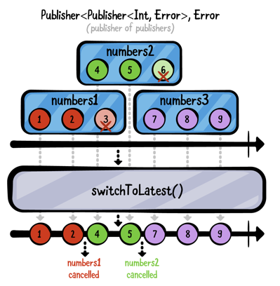
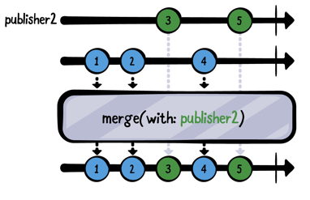
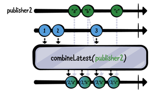
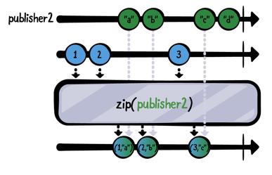

# Chapter5. Combining Operators

이번 챕터에서 배울 내용은 Combining Operator다. 이 오퍼레이터들은 각기 다른 Publisher들이 방출한 다수의 이벤트들을 조합하고, 사용하기 편하게 만들어주는 유용한 오퍼레이터들이 될 것이다.

예를 들어보자, user name, password 그리고 체크박스를 입력하는 UI가 있다고 생각해보자. 이들처럼 여러개의 정보를 편하게 다루기 위해서는 조합(Combine)이 유용할 것이다. 

## Prepending

원래 구독한 Publisher의 요소보다 먼저 이벤트를 방출하는데에 사용 된다. 이번 섹션에서는 prepend(Output...), prepend(Sequence), prepend(Publisher) 3가지에 대해 배울 것이다.

### prepend(Output...)

파라미터에 ... 구문을 사용하여, 원하는 만큼의 값의 가변 목록을 넘길 수 있다. prepend에 같은 타입의 값을 넘기면, 원하는 만큼 값을 사용할 수 있다. 

~~~swift
 // 1
  let publisher = [3, 4].publisher
  
  // 2
  publisher
    .prepend(1, 2)
    .sink(receiveValue: { print($0) })
    .store(in: &subscriptions)
~~~

1. 3,4를 방출하는 Publisher를 생성하였다.
2. prepend를 이용하여 기존 publisher가 값을 사용하기 전에  1,2를 추가하였다.

~~~
——— Example of: prepend(Output...) ———
1
2
3
4
~~~

간단하게 출력 하였다.

~~~
.prepend(1, 2)
~~~

위의 코드에서 새로운 코드를 추가해본다

~~~
.prepend(-1, 0)
~~~

~~~
——— Example of: prepend(Output...) ———
-1
0
1
2
3
4
~~~

출력해보면 알겠지만, 여기서 중요한 것은 마지막에 사용한 prepend가 가장 첫 upstream으로 출력된다는 점이다. 

### prepend(Sequence)

이번 sequence를 넘기는 prepend 오퍼레이터는 이전과 비슷하다. 차이점은 파라미터인데, Sequence 프로토콜을 따르는 객체를 넘기는 것이다. Array 혹은 Set과 같은 것들이다.

~~~swift
 // 1
  let publisher = [5, 6, 7].publisher
  
  // 2
  publisher
    .prepend([3, 4])
    .prepend(Set(1...2))
    .sink(receiveValue: { print($0) })
    .store(in: &subscriptions)
~~~

1. 5,6,7을 출력하는 Publisher 생성.
2. prepend(Sequence)를 2번 연속으로 사용하였다. 

~~~
——— Example of: prepend(Sequence) ———
1
2
3
4
5
6
7
~~~

> 한가지, 유의해야할 점은 Array와 다르게 Set은 정렬을 보장하지 않는다. 즉, 위의 예제를 보면 "1,2" 혹은 "2,1" 순서로 출력 될 것이다.

재밌는 걸 해볼 차례다.

~~~swift
.prepend(Set(1...2))
~~~

위의 코드 밑에 아래 코드를 추가해보자.

~~~swift
.prepend(stride(from: 6, to: 11, by: 2))
~~~

Strideable 프로토콜을 구현한 stride 타입을 사용하였다. 6부터 11까지 2씩 증가하는 것인데, Strideable 프로토콜은 Sequence 프로토콜을 준수해서 가능한 일이다.

~~~
——— Example of: prepend(Sequence) ———
6
8
10
1
2
3
4
5
6
7
~~~

### prepend(Publisher)

이번 prepend는 서로 다른 publisher가 있고, 이를 합치고 싶을 때 사용한다. 

~~~swift
// 1
let publisher1 = [3,4].publisher
let publisher2 = [1,2].publisher

// 2
publisher1
	.prepend(publisher2)
	.sink(receiveValue: { print($0) })
	.store(in: &subscriptions)
~~~

1. 두 개의 Publisher를 만들었는데, 하나는 3,4를 출력하고 다른 하나는 1,2를 방출한다.
2. Publisher1 시작 부분에 publisher2에 prepend를 추가한다. publisher2가 방출되고 나서 publisher1의 값들이 방출 될 것이다. 

~~~
——— Example of: prepend(Publisher) ———
1
2
3
4
~~~

예상한대로, publisher2의 요소들 1,2과 먼저 출력되고 publisher1의 3과 4가 방출된다. 

이번엔 조금 더 심화로 들어가보자.

~~~swift
// 1
let publisher1 = [3, 4].publisher
let publisher2 = PassthroughSubject<Int, Never>()

// 2 
publisher1
	.prepend(publisher2)
	.sink(receiveValue: { print($0) })
	.store(in: &subscription)

// 3 
publisher2.send(1)
publisher2.send(2)
~~~

이전에 했던것과 비슷하지만 publisher2가 PassthroughSubject로서 값을 push 할 수 있다는 점이 다르다.

1. 두 개의 publisher를 생성했는데, 하나는 3,4를 출력하고 나머지 하나는 PassthroughSubject로서 동적으로 값을 방출한다. 
2. publisher1의 첫 시작 부분에 subject를 prepend하였다.
3. publisher2에 1,2를 send 했다.

~~~swift
——— Example of: prepend(Publisher) #2 ———
1
2
~~~

결과는 위와 같다. 

두 개만 출력 된 것이 이상하다고 생각하는가? 자세히 생각하면 답은 나와있다.

위에서 publisher2가 방출을 끝냈는가? 아니다. publisher2는 완료 이벤트를 방출하지 않았다. 이러한 이유 때문에, prepend를 사용 할 때, publisher는 반드시 완료 이벤트를 방출해야한다. 

위의 코드에서 아래의 코드를 추가해보자.

~~~swift
publisher2.send(completion: .finished)
~~~

publisher2가 끝이 나서야 publisher1의 방출을 받을 수 있다. 

~~~
1
2
3
4
~~~

## Appending

이번에 배울 것은 이전에 배운 prepend와 상당히 비슷하다. 이번엔 append(Output...), append(Sequence) and append(Publisher)에 대해 배울 것이다.

### append(Output...)

append(Output...)은 prepend와 대조적이다. 이것 또한 가변 리스트를 사용한다. 하지만 append는 기존 Publisher가 .finished 이벤트를 방출하면 그 뒤에 값들을 붙인다.

~~~swift
// 1
let publisher = [1].publisher

// 2
publisher
	.append(2,3)
	.append(4)
	.sink(receiveValue: { print($0) })
	.store(in: &subscriptions)
~~~

1. 1만 방출하는 Publisher를 생성.
2. append를 두번 사용하였다. 첫번째는 2,3을 그리고 4를 append 하였다.

~~~
——— Example of: append(Output...) ———
1
2
3
4
~~~

각각 append들은 위의 upstream이 완료 되고 나서야 append가 실행된다.

이것은 upstream은 반드시 complete가 되어야 다음 append가 실행된다. 이전 publisher가 finished가 되지 않는다면, append는 절대 실행되지 않는다. 

이를 확인해보자 

~~~swift
// 1
let publisher = PassthroughSubject<Int, Never>()

publisher
	.append(3, 4)
	.append(5)
	.sink(receiveValue: { print($0) })
	.store(in: &subscriptions)

// 2
publisher.send(1)
publisher.send(2)
~~~

예상한거와 같이 아래와 같이 1,2만 출력된다.

~~~
——— Example of: append(Output...) #2 ———
1
2
~~~

 위 코드에서 사용된 append들은 publisher가 완료 되지 않았기 때문에, 아무 일도 하지 않았다. 

위에서 아래 코드를 추가해보면 잘 출력 될 것이다.

~~~
publisher.send(completion: .finished)
~~~

~~~
——— Example of: append(Output...) #2 ———
1
2
3
4
5
~~~

### append(Sequence)

Sequence 프로토콜을 준수하는 객체들을 받을 수 있다. 기존 publisher가 모두 방출되고 완료 되고 나면 append가 실행 된다. 

~~~swift
// 1
let publisher = [1,2,3].publisher

publisher
	.append([4,5]) // 2
	.append(Set([6,7])) // 3
	.append(stride(from: 8, to: 11, by: 2)) // 4
	.sink(receiveValue: { print($0) })
	.store(in: &subscriptions)
~~~

1. 1,2,3을 방출하는 publisher 생성.
2. 4,5를 방출하는 Array 타입의 append 실행 (정렬 됨.)
3. 6,7를 방출하는.Set append (정렬 안 됨)
4. Strideable 프로토콜의 strides append

~~~
——— Example of: append(Sequence) ———
1
2
3
4
5
7
6
8
10
~~~

### append(Publisher)

기존 publisher가 완료가 되면 append 된 publisher가 추가로 값을 방출하는 append 이다.

~~~swift
// 1
let publusher1 = [1, 2].publisher
let publisher2 = [3, 4].publisher

// 2
publisher1 
	.append(publisher2)
	.sink(receivceValue: { print($0) })
	.store(in: &subscriptions)
~~~

~~~
——— Example of: append(Publisher) ———
1
2
3
4
~~~

## Advanced combining

### switchToLatest

조금 복잡하지만 굉장히 유용하게 쓰이는 오퍼레이터다. 기존 publisher의 canceling을 보류시켜 다른 publisher로 교체 할 수 있고, 자신이 방출한 publisher의 스트림에서만 사용 할 수 있다.

무슨 말인지 어려울 것이다. 마블 다이어그램과 코드를 살펴보자

~~~swift
3// 1
let publisher1 = PassthroughSubject<Int,Never>() 
let publisher2 = PassthroughSubject<Int,Never>()
let publisher3 = PassthroughSubject<Int,Never>()

// 2 
let publishers = PassthroughSubject<PassthroughSubject<Int,Never>, Never>()

// 3
publishers
	.switchToLatest()
	.sink(receiveCompletion: { _ in print("Completed!") },
        receiveValue: { print($0) })
	.store(in: &subscription)

// 4
publishers.send(publisher1)
publisher1.send(1)
publisher1.send(2)

// 5
publishers.send(publisher2)
publisher1.send(3)
publisher2.send(4)
publisher2.send(5)

// 6
publishers.send(publisher3)
publisher2.send(6)
publisher3.send(7)
publisher3.send(8)
publisher3.send(9)

// 7
publisher3.send(completion: .finished)
publishers.send(completion: .finished)
~~~

코드가 많다고 걱정하지 말자. 같이 하나씩 들여다보자.

1. integer와 에러 없는 PassthroughSubject 들을 만들었다.
2. 또 다른 PassthroughSubject를 만들었는데, 이번엔 PassthroughSubject와 Never를 받는 subject다. Publisher1, Publisher2, Publisher3들과 같은 subject들을 받을 수 있다.
3. switchToLatest()를 사용했는데, 매번 다른 publisher들을 받을 때 마다 새로운 publisher로 바꿀 것이고 이전 publisher는 cancel 처리 한다.
4. publisher에 publisher1을 보내고, 그 후에 publisher1에게 1과 2를 보냈다.
5. publisher에 publisher2를 보냈고, 이전 publisher1은 cancel 된다. 그 이후에 publisher1에 3을 보내지만, 이는 무시된다. publisher2에 4와 5를 보내는데, 현재 publisher2를 구독 중이기에 이 값들을 받을 수 있다.
6. publisher2에서 publisher3으로 교체한다. 이전과 같이 publisher2에 6을 보내보지만 이미 cancel 되어서 무시된다. 그 후에 publisher3에 7,8,9를 보낸다.
7. 마지막으로 현재 구독중인 publisher3에 .finished를 보내고, publishers에도 .finished를 보내어 활성화 되어 있던 모든 구독을 완료 시킨다.

~~~
——— Example of: switchToLatest ———
1
2
4
5
7
8
9
Completed!
~~~

위의 설명을 보고도 실제 앱에서 어떻게 적용해야하나 싶은 생각이 들 수도 있다. 아래와 같은 시나리오를 예로 들어보겠다.

유저가 버튼을 tap하면서 network 리퀘스트 트리거를 발생 시켰다고 보자. tap한 즉시, 유저가 버튼을 다시 눌렀다, 총 두 번의 네트워크 리퀘스트가 연속으로 발생 되었다. 그러나 첫 번째의 네트워크 리퀘스트가 아직 응답을 받기 전이라면 어떻게 해야 할까? 가장 마지막의 리퀘스트만 요청을 보내려면 어떻게 해야할까? 

이럴 때, switchToLatest를 사용하면 된다!

코드로 자세히 살펴보자.

~~~swift
var subscription: AnyCancellable?

let url = URL(string: "https://source.unsplash.com/random")

// 1 
func getImage() -> AnyPublisher<UIImage?, Never> { 
  return URLSession
  	.shared
  	.dataTaskPublisher(for: url)
  	.map { data, _ in UIImage(data:data) }
  	.print("image")
  	.replaceError(with: nil)
  	.eraseToAnyPublisher()
}

// 2
let taps = PassthroughSubject<Void, Never>()

subscription = taps
	.map { _ in getImage() } // 3
	.switchToLatest() // 4
	.sink(receiveValue: { _ in })

// 5
taps.send()

DispatchQueue.main.asyncAfter(deadline: .now() + 3) {
    taps.send()
}

DispatchQueue.main.asyncAfter(deadline: .now() + 3.1) {
    taps.send()
}

~~~

1. 랜덤 이미지를 받는 API에 네트워크 요청을 하는 getImage() 함수를 정의하였다. 
2. PassthroughSubject 를 유저가 버튼을 tap하는 subject로 생각하고 만들었다.
3. button을 탭하면 getImage()를 호출하여 네트워크 요청을 해준다. switchToLatest를 통해 <Void, Never> 타입의 스트림을 <UIImage?, Never>로 변경하였다. 
4. 이전 예제에서 사용했었던 switchToLatest를 다시 사용하였다. 이는 하나의 publisher만 이벤트를 방출하도록 보장해주고, 이전 subscriptio은 cancel을 하게 된다.
5. DispatchQueue를 이용하여 버튼을 총 3번 탭하도록 상황을 부여하였다. 첫번쨰 tap이 발생 되고나서 3초 후에 두번 째 탭을 발생시 켰다. 그러고 0.1초 후에 다시 탭을 발생 시켰다. 

출력 값은 아래와 같다

~~~
——— Example of: switchToLatest - Network Request ———
image: receive subscription: (DataTaskPublisher)
image: request unlimited
image: receive value: (Optional(<UIImage:0x600000364120 anonymous {1080, 720}>))
image: receive finished
image: receive subscription: (DataTaskPublisher)
image: request unlimited
image: receive cancel
image: receive subscription: (DataTaskPublisher)
image: request unlimited
image: receive value: (Optional(<UIImage:0x600000378d80 anonymous {1080, 1620}>))
image: receive finished
~~~

출력을 보면 알겠지만  image를 2번만 fetch 한 것을 볼 수 있다. 두번째 탭이 무시되어진 것인데, 세번째 탭이 발생 되었을 때, 두번째  subscription이 cancel 된 것이다. image: receive cancel 이 출력 된 것을 보면 알 수 있다.

### merge(with:)

이 오퍼레이터는 **같은 타입**의 서로 다른 publisher들끼리 합치는 것이라고 보면 된다. 

~~~swift
// 1
let publisher1 = PassthroughSubject<Int, Never>()
let publisher2 = PassthroughSubject<Int, Never>()

// 2
publisher1 
 	.merge(with: publisher2)
	.sink(receiveCompletion: { _ in print("Completed") },
        receiveValue: { print($0) })
	.store(in: &subscriptions)

// 3
publisher1.send(1)
publisher1.send(2)

publisher2.send(3)
publisher1.send(4)
publisher2.send(5)

// 4
publisher1.send(completion: .finished)
publisher2.send(completion: .finished)
	
~~~

1. integer와 never 타입의 PassthroughSubject를 생성하였다.
2. publisher1과 publisher2를 merge하여, 양 쪽의 방출을 합쳤다. Combine은 최대 8개 까지 합칠 수 있도록 제공되고 있다. 
3. 각각 publisher1과 publisher2에게 값들을 보내고 있다.
4. 각각 publisher1과 publisher2에게 .finished를 보냈다.

~~~
——— Example of: merge(with:) ———
1
2
3
4
5
Completed
~~~

### CombineLatest

앞에서 배운 merge 오퍼레이터는 같은 타입의 publisher들 끼리만 조합이 가능했다면, 이번 오퍼레이터는 다른 타입의 publisher 들끼리도 조합이 가능해서 유용하게 쓰일 수 있다. 

하지만 유의해야할 점은 모든 타입의 publisher를 받을 수 있지만,그들 중 값을 방출 할 때마다 그들의 모든 최신 값들이 출력되고 출력은 **tuple** 형식으로 출력된다. CombineLatest에 입력 된 Publisher들은 적어도 하나의 값을 출력이 되었어야 CombineLatest가 값을 방출 할 수 있다. 

 

~~~swift
// 1
let publisher1 = PassthroughSubject<Int, Never>()
let publisher2 = PassthroughSubject<String, Never>()

// 2
publisher1
	.combineLatest(publisher2)
	.sink(receiveCompletion: { _ in print("Completed") },
        receiveValue: { print("P1: \($0), P2: \($1)") })
	.store(in: &subscriptions)

// 3
publisher1.send(1)
publisher1.send(2)

publisher2.send("a")
publisher2.send("b")

publisher1.send(3)
publisher2.send("c")

// 4 
publisher1.send(completion: .finished)
publisher2.send(completion: .finished)
~~~

1. 2개의 PassthroughSubject를 생성헀는데, 하나는 Int 타입의 하나는 String 타입을 받는 Subject를 생성했다.
2. publisher1과 publisher2를 combineLatest를 선언하였다. combine은 최대 4개까지 서로 다른 publisher를 combineLatest에 선언할 수 있다.
3. publisher1과 publisher2에게 각각 값들을 전송하고 있다.

~~~
——— Example of: combineLatest ———
P1: 2, P2: a
P1: 2, P2: b
P1: 3, P2: b
P1: 3, P2: c
Completed
~~~

위 결과에서 주목해야할 점은 publisher1이 1을 send 했음에도 불구하고 출력되지 않았다는 것이다. 이유는 combineLatest는 항상 각 요소들의 최신 값을 출력하는데 있다. publisher2가 a를 보넀을 때, 그 당시 publisher1의 최신 값은 2이므로 (2,"a")가 출력 된 것이다.

### zip

기존 swift의 zip과 유사하게 동작한다. 이 오퍼레이터는 동일한 인덱스에서 쌍을 이루는 tuple을 출력한다. 이 오퍼레이터는 각 publisher들이 값을 방출할때까지 기다린다. 모든 publisher가 현재 인덱스에서 값을 내보내면 tuple 형태로 방출한다. 즉, 두 publisher를 zip하면 각 publisher들이 값을 방출 할 때마다 한개의 tuple을 방출한다.

~~~swift
// 1
let publisher1 = PassthroughSubject<Int, Never>()
let publisher2 = PassthroughSubject<String, Never>()

// 2
publisher1
	.zip(publisher2)
	.sink(receiveCompletion: { _ in print("Completed") }.
       	receiveValue: { print("P1: \($0), P2: \($1)") })
	.store(in: &subscriptions)

// 3
publisher1.send(1)
publisher1.send(2)
publisher2.send("a")
publisher2.send("b")
publisher1.send(3)
publisher2.send("c")
publisher2.send("d")
	
// 4
publisher1.send(completion: .finished)
publisher2.send(completion: .finished)
~~~

~~~
——— Example of: zip ———
P1: 1, P2: a
P1: 2, P2: b
P1: 3, P2: c
Completed
~~~

여기서 주목할 점은 다른 publisher가 값을 방출 될 떄까지 기다린다는 것이다. 처음으로 방출 된 1은 두번쨰 publisher가 값을 방출 할때까지 기다렸고, 결국 (1,"a")가 출력 되었다. 그런 다음 2가 방출되고 두 번째의 다른 publisher 값을 기다렸고, (2,"b")가 출력 되었다. 마지막 "d"의 방출은 무시되어졌는데, publisher1에 대응 될 값이 없어서 출력되지 못하였다. 

