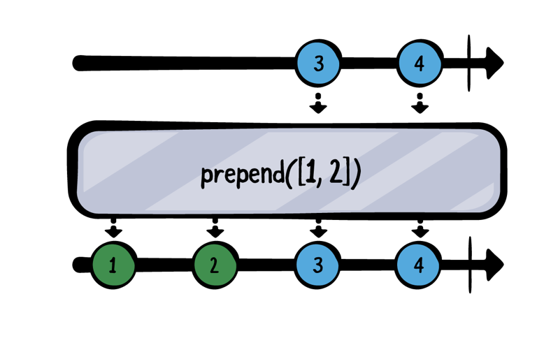

# Chapter5. Combining Operators

이번 챕터에서 배울 내용은 Combining Operator다. 이 오퍼레이터들은 각기 다른 Publisher들이 방출한 다수의 이벤트들을 조합하고, 사용하기 편하게 만들어주는 유용한 오퍼레이터들이 될 것이다.

예를 들어보자, user name, password 그리고 체크박스를 입력하는 UI가 있다고 생각해보자. 이들처럼 여러개의 정보를 편하게 다루기 위해서는 조합(Combine)이 유용할 것이다. 

## Prepending

원래 구독한 Publisher의 요소보다 먼저 이벤트를 방출하는데에 사용 된다. 이번 섹션에서는 prepend(Output...), prepend(Sequence), prepend(Publisher) 3가지에 대해 배울 것이다.

### prepend(Output...)

파라미터에 ... 구문을 사용하여, 원하는 만큼의 값의 가변 목록을 넘길 수 있다. prepend에 같은 타입의 값을 넘기면, 원하는 만큼 값을 사용할 수 있다. 

~~~swift
 // 1
  let publisher = [3, 4].publisher
  
  // 2
  publisher
    .prepend(1, 2)
    .sink(receiveValue: { print($0) })
    .store(in: &subscriptions)
~~~

1. 3,4를 방출하는 Publisher를 생성하였다.
2. prepend를 이용하여 기존 publisher가 값을 사용하기 전에  1,2를 추가하였다.

~~~
——— Example of: prepend(Output...) ———
1
2
3
4
~~~

간단하게 출력 하였다.

~~~
.prepend(1, 2)
~~~

위의 코드에서 새로운 코드를 추가해본다

~~~
.prepend(-1, 0)
~~~

~~~
——— Example of: prepend(Output...) ———
-1
0
1
2
3
4
~~~

출력해보면 알겠지만, 여기서 중요한 것은 마지막에 사용한 prepend가 가장 첫 upstream으로 출력된다는 점이다. 

### prepend(Sequence)

이번 sequence를 넘기는 prepend 오퍼레이터는 이전과 비슷하다. 차이점은 파라미터인데, Sequence 프로토콜을 따르는 객체를 넘기는 것이다. Array 혹은 Set과 같은 것들이다.

~~~swift
 // 1
  let publisher = [5, 6, 7].publisher
  
  // 2
  publisher
    .prepend([3, 4])
    .prepend(Set(1...2))
    .sink(receiveValue: { print($0) })
    .store(in: &subscriptions)
~~~

1. 5,6,7을 출력하는 Publisher 생성.
2. prepend(Sequence)를 2번 연속으로 사용하였다. 

~~~
——— Example of: prepend(Sequence) ———
1
2
3
4
5
6
7
~~~

> 한가지, 유의해야할 점은 Array와 다르게 Set은 정렬을 보장하지 않는다. 즉, 위의 예제를 보면 "1,2" 혹은 "2,1" 순서로 출력 될 것이다.

재밌는 걸 해볼 차례다.

~~~swift
.prepend(Set(1...2))
~~~

위의 코드 밑에 아래 코드를 추가해보자.

~~~swift
.prepend(stride(from: 6, to: 11, by: 2))
~~~

Strideable 프로토콜을 구현한 stride 타입을 사용하였다. 6부터 11까지 2씩 증가하는 것인데, Strideable 프로토콜은 Sequence 프로토콜을 준수해서 가능한 일이다.

~~~
——— Example of: prepend(Sequence) ———
6
8
10
1
2
3
4
5
6
7
~~~

### prepend(Publisher)

이번 prepend는 서로 다른 publisher가 있고, 이를 합치고 싶을 때 사용한다. 

~~~swift
// 1
let publisher1 = [3,4].publisher
let publisher2 = [1,2].publisher

// 2
publisher1
	.prepend(publisher2)
	.sink(receiveValue: { print($0) })
	.store(in: &subscriptions)
~~~

1. 두 개의 Publisher를 만들었는데, 하나는 3,4를 출력하고 다른 하나는 1,2를 방출한다.
2. Publisher1 시작 부분에 publisher2에 prepend를 추가한다. publisher2가 방출되고 나서 publisher1의 값들이 방출 될 것이다. 

~~~
——— Example of: prepend(Publisher) ———
1
2
3
4
~~~

예상한대로, publisher2의 요소들 1,2과 먼저 출력되고 publisher1의 3과 4가 방출된다. 

이번엔 조금 더 심화로 들어가보자.

~~~swift
// 1
let publisher1 = [3, 4].publisher
let publisher2 = PassthroughSubject<Int, Never>()

// 2 
publisher1
	.prepend(publisher2)
	.sink(receiveValue: { print($0) })
	.store(in: &subscription)

// 3 
publisher2.send(1)
publisher2.send(2)
~~~

이전에 했던것과 비슷하지만 publisher2가 PassthroughSubject로서 값을 push 할 수 있다는 점이 다르다.

1. 두 개의 publisher를 생성했는데, 하나는 3,4를 출력하고 나머지 하나는 PassthroughSubject로서 동적으로 값을 방출한다. 
2. publisher1의 첫 시작 부분에 subject를 prepend하였다.
3. publisher2에 1,2를 send 했다.

~~~swift
——— Example of: prepend(Publisher) #2 ———
1
2
~~~

결과는 위와 같다. 

두 개만 출력 된 것이 이상하다고 생각하는가? 자세히 생각하면 답은 나와있다.

위에서 publisher2가 방출을 끝냈는가? 아니다. publisher2는 완료 이벤트를 방출하지 않았다. 이러한 이유 때문에, prepend를 사용 할 때, publisher는 반드시 완료 이벤트를 방출해야한다. 

위의 코드에서 아래의 코드를 추가해보자.

~~~swift
publisher2.send(completion: .finished)
~~~

publisher2가 끝이 나서야 publisher1의 방출을 받을 수 있다. 

~~~
1
2
3
4
~~~

## Appending

이번에 배울 것은 이전에 배운 prepend와 상당히 비슷하다. 이번엔 append(Output...), append(Sequence) and append(Publisher)에 대해 배울 것이다.

### append(Output...)

append(Output...)은 prepend와 대조적이다. 이것 또한 가변 리스트를 사용한다. 하지만 append는 기존 Publisher가 .finished 이벤트를 방출하면 그 뒤에 값들을 붙인다.

~~~swift
// 1
let publisher = [1].publisher

// 2
publisher
	.append(2,3)
	.append(4)
	.sink(receiveValue: { print($0) })
	.store(in: &subscriptions)
~~~

1. 1만 방출하는 Publisher를 생성.
2. append를 두번 사용하였다. 첫번째는 2,3을 그리고 4를 append 하였다.

~~~
——— Example of: append(Output...) ———
1
2
3
4
~~~

각각 append들은 위의 upstream이 완료 되고 나서야 append가 실행된다.

이것은 upstream은 반드시 complete가 되어야 다음 append가 실행된다. 이전 publisher가 finished가 되지 않는다면, append는 절대 실행되지 않는다. 

이를 확인해보자 

~~~swift
// 1
let publisher = PassthroughSubject<Int, Never>()

publisher
	.append(3, 4)
	.append(5)
	.sink(receiveValue: { print($0) })
	.store(in: &subscriptions)

// 2
publisher.send(1)
publisher.send(2)
~~~

예상한거와 같이 아래와 같이 1,2만 출력된다.

~~~
——— Example of: append(Output...) #2 ———
1
2
~~~

 위 코드에서 사용된 append들은 publisher가 완료 되지 않았기 때문에, 아무 일도 하지 않았다. 

위에서 아래 코드를 추가해보면 잘 출력 될 것이다.

~~~
publisher.send(completion: .finished)
~~~

~~~
——— Example of: append(Output...) #2 ———
1
2
3
4
5
~~~

### append(Sequence)

Sequence 프로토콜을 준수하는 객체들을 받을 수 있다. 기존 publisher가 모두 방출되고 완료 되고 나면 append가 실행 된다. 

~~~swift
// 1
let publisher = [1,2,3].publisher

publisher
	.append([4,5]) // 2
	.append(Set([6,7])) // 3
	.append(stride(from: 8, to: 11, by: 2)) // 4
	.sink(receiveValue: { print($0) })
	.store(in: &subscriptions)
~~~

1. 1,2,3을 방출하는 publisher 생성.
2. 4,5를 방출하는 Array 타입의 append 실행 (정렬 됨.)
3. 6,7를 방출하는.Set append (정렬 안 됨)
4. Strideable 프로토콜의 strides append

~~~
——— Example of: append(Sequence) ———
1
2
3
4
5
7
6
8
10
~~~

### append(Publisher)

기존 publisher가 완료가 되면 append 된 publisher가 추가로 값을 방출하는 append 이다.

~~~swift
// 1
let publusher1 = [1, 2].publisher
let publisher2 = [3, 4].publisher

// 2
publisher1 
	.append(publisher2)
	.sink(receivceValue: { print($0) })
	.store(in: &subscriptions)
~~~

~~~
——— Example of: append(Publisher) ———
1
2
3
4
~~~

## Advanced combining

