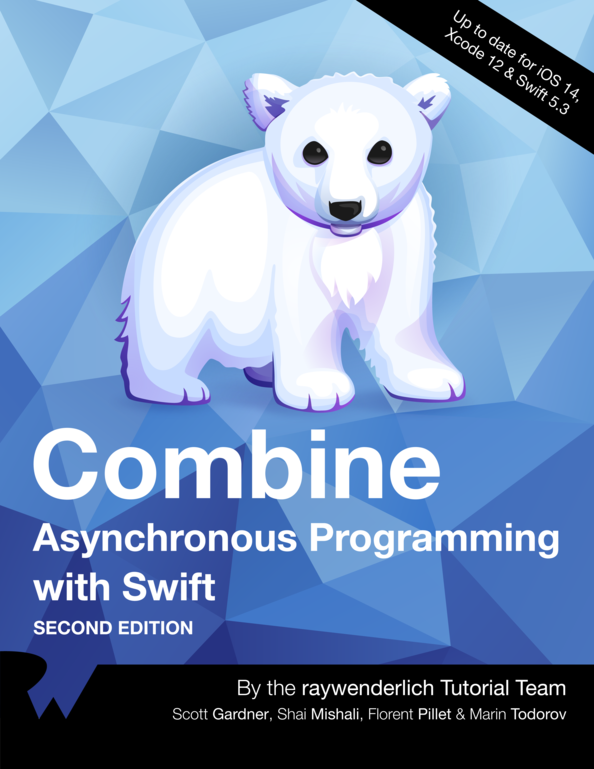

# Combine: Asynchronous Programming with Swift

> Combine Asynchronous Programming with Swift의 책을 번역하며 Combine framework를 스터디합니다.

## Section1: Introduction to Combine

- Chapter1. [Hello, Combine!](https://github.com/wjdgo813/Combine_raywenderlich/blob/master/1.Hello_Combine.md)
- Chapter2. [Publisher & Subscribers](https://github.com/wjdgo813/Combine_raywenderlich/blob/master/2.%20Publishers%20%26%20Subscribers.md)

## Section2: Operators

- Chapter3. [Transforming Operators](https://github.com/wjdgo813/Combine_raywenderlich/blob/master/3.%20Transaforming%20Operators.md)
- Chapter4. [Filtering Operators](https://github.com/wjdgo813/Combine_raywenderlich/blob/master/4.%20Filtering%20Operators.md)
- Chapter5. [Combining Operators](https://github.com/wjdgo813/Combine_raywenderlich/blob/master/5.%20Combining%20Operators.md)

